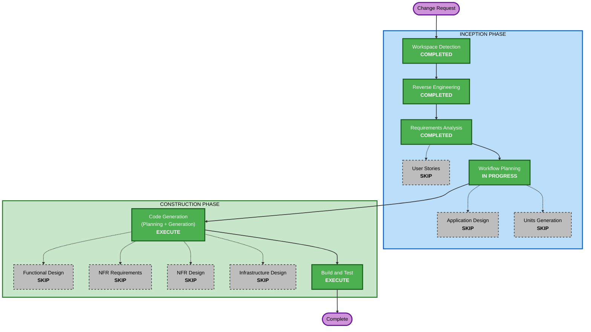

# Cycle 2 Execution Plan - 프로젝트(데이터셋) 선택 기능

작성일: 2026-09-28. 유닛: labelon-ucle-reviewer (기존 단일 유닛)

## Detailed Analysis Summary

### Transformation Scope (Brownfield)
- **Transformation Type**: Single component set change (기존 컴포넌트 경계 안의 기능 확장)
- **Primary Changes**: 파서에 프로젝트 홈 목록 파싱 추가, 브라우저 세션에 홈 HTML 조회 추가, 서비스에 데이터셋 선택 상태·저장 추가, 웹 API 3개 추가, 프론트엔드 드롭다운·이력 열, 규칙 검사 페르소나 비교 제거, 설정 persona 선택화
- **Related Components**: C-01 Config, C-02 Browser, C-03 Parser, C-05 RuleChecker, C-12 History(요약 집계), C-13 WebApp, C-14 Frontend, S-01/S-02 Services, prompts

### Change Impact Assessment
- **User-facing changes**: Yes. 헤더 드롭다운·새로고침·데이터셋 배지, 이력 열
- **Structural changes**: No. 새 컴포넌트 없음(선택 상태는 서비스 계층의 작은 상태 객체 + JSON 파일)
- **Data model changes**: Minor. `data/ui-state.json` 신설, 이력 DB 는 기존 dataset_id 열 활용(스키마 변경 없음). InstructionCheck.persona_matches_config 는 하위 호환 위해 유지(항상 True)
- **API changes**: Yes. 로컬 API 3개 추가, /state 스냅샷 필드 2개 추가
- **NFR impact**: No. 기존 보안(Origin 검사)·성능 패턴 그대로

### Component Relationships
- **Primary**: services.py(DatasetService 신설), labelon/parser.py(list parsing), web/app.py, web/static/app.js
- **Shared**: domain.py(DatasetInfo 엔티티), config.py(persona optional)
- **Dependent**: rules.py, prompts/__init__.py(persona 출처 변경), history.py(summary by dataset)
- **Supporting**: tests, fixtures(project_home_sample.html), docs

### Risk Assessment
- **Risk Level**: Low. 롤백은 코드 되돌리기, 외부 부작용 없음(목록 조회는 읽기 전용)
- **Rollback Complexity**: Easy
- **Testing Complexity**: Simple (픽스처 파싱 + Fake 기반 API 테스트 + 실사이트 수동 1회)

## Workflow Visualization

### Mermaid Diagram


### Text Alternative
```
INCEPTION: Workspace Detection COMPLETED / Reverse Engineering COMPLETED / Requirements Analysis COMPLETED
           User Stories SKIP / Workflow Planning IN PROGRESS / Application Design SKIP / Units Generation SKIP
CONSTRUCTION (labelon-ucle-reviewer): Functional Design SKIP / NFR Requirements SKIP / NFR Design SKIP /
           Infrastructure Design SKIP / Code Generation EXECUTE / Build and Test EXECUTE
```

## Phases to Execute

### INCEPTION PHASE
- [x] Workspace Detection (COMPLETED)
- [x] Reverse Engineering (COMPLETED)
- [x] Requirements Analysis (COMPLETED)
- [x] User Stories (SKIPPED) — 기존 US-2/US-8/US-9 확장, 인수 기준 AC-C2-1~6 으로 충분
- [x] Execution Plan (IN PROGRESS)
- [ ] Application Design - SKIP — 새 컴포넌트 없음. DatasetService 는 기존 서비스 계층 패턴을 따르며 코드 생성 계획에서 메서드를 정의
- [ ] Units Generation - SKIP — 단일 유닛

### CONSTRUCTION PHASE
- [ ] Functional Design - SKIP — 목록 파싱(정규식+텍스트 분해)과 선택 상태(허용 상태 집합)는 단순. 규칙은 코드 생성 계획에 명시
- [ ] NFR Requirements - SKIP — 새 NFR 없음
- [ ] NFR Design - SKIP
- [ ] Infrastructure Design - SKIP — 로컬 실행
- [ ] Code Generation - EXECUTE — 계획 승인 후 생성
- [ ] Build and Test - EXECUTE — pytest, ruff, 실사이트 목록 조회 스모크(읽기 전용), 사용자 수동 전환 검증

## Package Change Sequence
단일 패키지. 변경 순서: domain → config/rules/prompts → parser(+fixture) → browser → services(DatasetService, fetch 대상) → web/app → app.js → history summary → tests → docs

## Estimated Timeline
- 코드 생성 1회 승인, 빌드·테스트 1회. 약 1시간

## Success Criteria
- AC-C2-1~6 충족, 기존 테스트 74개 유지, 새 테스트 통과
- 실제 LabelOn 에서 목록 6개가 드롭다운에 보이고, 다른 데이터셋으로 가져오기가 동작
