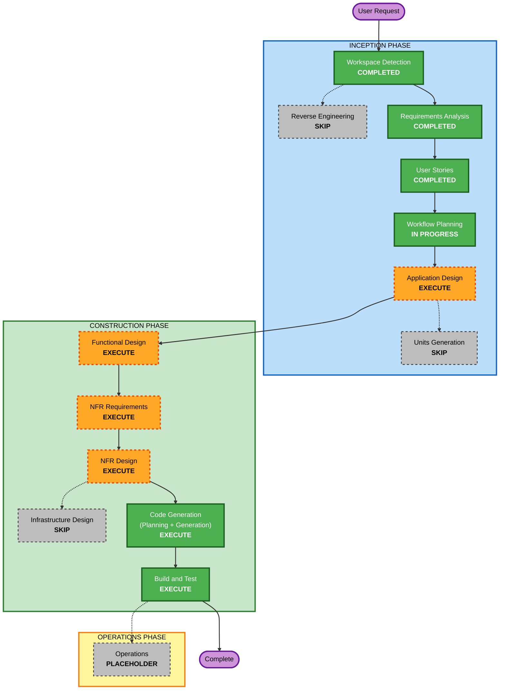

# Execution Plan

작성일: 2026-09-23
프로젝트: LabelOn UC-LE 어노테이터 초안 검토 자동화 도구 (Greenfield)

## Detailed Analysis Summary

### Change Impact Assessment
- **User-facing changes**: Yes. 로컬 웹 검토 화면(신규)과 도구 전용 Chrome 창. 사용자 여정 9개 스토리(US-1~US-9)
- **Structural changes**: Yes. 신규 시스템. 브라우저 세션 관리, 페이지 파서, 2단계 모델 파이프라인, 검토 UI 서버, 제출기, 이력 저장소로 구성
- **Data model changes**: Yes. 로컬 SQLite 이력 스키마(원천, 초안, 판정, 수정안, 최종값, 제출 본문·응답, 토큰), 모델 출력 JSON 스키마(판정/수정), 설정 파일 스키마
- **API changes**: 외부 API는 소비만 함. LabelOn 비공식 엔드포인트(`/job/ucle/annotator/set`, `/resetData`, `/refreshSession`)와 Claude 모델 호출. 내부적으로 검토 UI와 백엔드 간 로컬 HTTP API 신설
- **NFR impact**: Yes. 인증 경로(구독 계정 자격증명 재사용, RK-1), 개인정보(이미지 외부 전송, 로컬 전용 저장), 성능(건당 3분 이내, 프롬프트 캐싱), 신뢰성(재시도, 만료 처리, 명시적 제출)

### Application Layer Impact
- **Code changes**: 신규 Python 애플리케이션 전체
- **Dependencies**: playwright(설치됨), claude-agent-sdk 또는 anthropic, 로컬 웹 프레임워크(설계 단계 선정), sqlite3(표준), Pillow(이미지 축소), pydantic(스키마)
- **Configuration**: 설정 파일(데이터셋 ID, 페르소나, 아키타입 템플릿, 임계값, 모델 ID, 캐시 보관 일수, 포트)
- **Testing**: 파서·판정·직렬화 단위 테스트, LabelOn 페이지 픽스처 기반 통합 테스트, 모델 호출 목(mock), 수동 E2E 체크리스트

### Infrastructure Layer Impact
- 없음. 사용자 PC(Windows 11) 로컬 실행. 클라우드 자원, 배포 파이프라인 없음

### Operations Layer Impact
- 로컬 로그 파일과 이력 DB로 충족. 별도 모니터링·알림 없음

### Risk Assessment
- **Risk Level**: Medium. 외부 시스템 2개(LabelOn 비공식 구조, Claude 인증 경로)에 의존하고, 잘못된 제출은 검수 반려라는 실제 비용이 있다. 반면 사람 확인 게이트가 있어 자동 오제출 위험은 낮다
- **Rollback Complexity**: Easy. 로컬 도구를 중단하면 기존 수동 작업으로 즉시 복귀
- **Testing Complexity**: Moderate. 브라우저와 외부 모델은 목·픽스처로 격리하고, 실제 제출은 사용자 입회 하에 1건씩 검증

## Workflow Visualization

### Mermaid Diagram



### Text Alternative

```
INCEPTION PHASE
  Workspace Detection ....... COMPLETED
  Reverse Engineering ....... SKIP (Greenfield)
  Requirements Analysis ..... COMPLETED
  User Stories .............. COMPLETED
  Workflow Planning ......... IN PROGRESS
  Application Design ........ EXECUTE
  Units Generation .......... SKIP (단일 유닛)

CONSTRUCTION PHASE (단일 유닛: labelon-ucle-reviewer)
  Functional Design ......... EXECUTE
  NFR Requirements .......... EXECUTE
  NFR Design ................ EXECUTE
  Infrastructure Design ..... SKIP (로컬 PC 실행)
  Code Generation ........... EXECUTE (Planning + Generation)
  Build and Test ............ EXECUTE

OPERATIONS PHASE
  Operations ................ PLACEHOLDER
```

## Phases to Execute

### INCEPTION PHASE
- [x] Workspace Detection (COMPLETED)
- [x] Reverse Engineering (SKIPPED - Greenfield)
- [x] Requirements Analysis (COMPLETED)
- [x] User Stories (COMPLETED)
- [x] Workflow Planning (IN PROGRESS)
- [ ] Application Design - EXECUTE
  - **Rationale**: 신규 컴포넌트 6개(브라우저 세션, 페이지 파서, 분석 파이프라인, 검토 UI 서버, 제출기, 이력 저장소)의 책임·메서드·의존 관계를 정의해야 한다. 특히 브라우저 컨텍스트와 모델 호출, UI 서버가 같은 프로세스에서 어떻게 협력하는지가 구현 난이도를 결정한다
- [ ] Units Generation - SKIP
  - **Rationale**: 단일 Python 애플리케이션 하나로 배포·실행된다. 컴포넌트는 여럿이지만 별도 팀·별도 배포 단위로 나눌 이유가 없다. 유닛 이름은 `labelon-ucle-reviewer` 하나로 두고 Construction 루프를 1회 수행한다

### CONSTRUCTION PHASE (유닛: labelon-ucle-reviewer)
- [ ] Functional Design - EXECUTE
  - **Rationale**: 검토 규칙 R1~R3의 판정 알고리즘, 정합성 점수 산식, 1단계·2단계 프롬프트와 출력 JSON 스키마, 검토 화면 상태 기계(준비됨 → 가져오는 중 → 판정 중 → 수정 중 → 검토 대기 → 제출/불가/반환/만료), 제출 본문 직렬화 규칙, 이력 DB 스키마를 상세히 정해야 한다
- [ ] NFR Requirements - EXECUTE
  - **Rationale**: 인증 경로(Claude Agent SDK vs ant OAuth 프로파일, RK-1)를 실제 계정으로 검증해 확정하고, 로컬 웹 프레임워크·이미지 축소 크기·프롬프트 캐싱 구조·재시도 정책·성능 목표를 기술 스택으로 고정해야 한다
- [ ] NFR Design - EXECUTE
  - **Rationale**: NFR Requirements에서 정한 인증, 캐싱, 재시도, 로컬 전용 저장, 명시적 제출 보장을 컴포넌트 설계에 반영한다. 깊이는 Minimal로 유지한다
- [ ] Infrastructure Design - SKIP
  - **Rationale**: 사용자 PC 로컬 실행. 클라우드 자원, 배포 아키텍처, 네트워크 구성이 없다. 필요한 것은 Python 가상환경과 Chrome 프로필 폴더뿐이며 이는 Build 지침에 포함한다
- [ ] Code Generation - EXECUTE (ALWAYS)
  - **Rationale**: Part 1 계획(파일 단위 체크리스트) 승인 후 Part 2에서 코드·테스트·설정 파일 생성
- [ ] Build and Test - EXECUTE (ALWAYS)
  - **Rationale**: 가상환경 구성, Playwright 브라우저 설치, 단위·통합 테스트, 실제 LabelOn 1건 수동 E2E 검증 절차 문서화

### OPERATIONS PHASE
- [ ] Operations - PLACEHOLDER
  - **Rationale**: 향후 확장 영역. 현재는 로컬 실행 안내가 Build and Test에 포함됨

## Estimated Timeline
- **Total Phases**: 실행 7개(Application Design, Functional Design, NFR Requirements, NFR Design, Code Generation, Build and Test + 진행 중인 Workflow Planning), 건너뜀 3개(Reverse Engineering, Units Generation, Infrastructure Design)
- **Estimated Duration**: 설계 3단계 각 1회 승인 사이클, 코드 생성 1~2회 승인 사이클, 빌드·테스트 1회. 사용자 응답 속도에 따라 반나절에서 이틀

## Success Criteria
- **Primary Goal**: 사용자가 로컬 검토 화면에서 "다음 건 가져오기 → 판정 확인 → 편집 → 승인/불가" 흐름으로 데이터셋 688 건을 처리하고, 제출은 사용자 클릭으로만 발생한다
- **Key Deliverables**: Python 애플리케이션 `labelon-ucle-reviewer`(브라우저 세션, 파서, 2단계 파이프라인, 검토 UI, 제출, 이력), 설정 파일, 테스트, 빌드·실행 지침
- **Quality Gates**:
  - 인수 기준 AC-1~AC-8 충족 (stories.md 인수 기준으로 검증)
  - 인증 경로가 실제 계정으로 1회 검증됨 (RK-1 해소)
  - 정상 제출 jobStatus 등 미확인 필드가 실제 관찰로 확정됨 (RK-4 해소)
  - 비밀번호·API 키가 저장된 파일 없음
