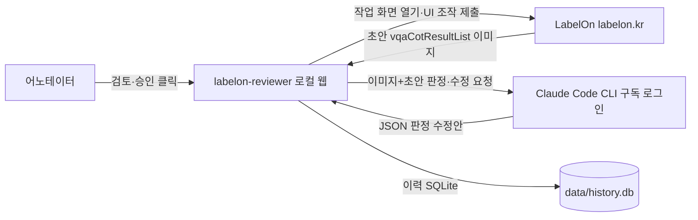

# Business Overview (Reverse Engineering, 2026-09-28)

대상: `labelon-reviewer 0.1.0` (C:\Users\sbahn\label_work). 2026-09-23 AI-DLC 사이클 1에서 생성한 코드. 상세 설계 문서(`aidlc-docs/inception/*`, `aidlc-docs/construction/*`)가 코드와 일치하므로 이 문서는 요약과 차이점만 기록한다.

## Business Context Diagram

## Business Description
- **Business Description**: LabelOn UC-LE 데이터셋의 어노테이터 작업(서버 초안 검토·수정·제출)을 비전 모델로 보조하고, 사람이 확인한 뒤에만 제출하는 로컬 도구
- **Business Transactions**:
  1. 로그인 세션 준비: 도구 전용 Chrome 프로필에서 사용자가 직접 LabelOn 로그인, 요청 API 리다이렉트로 로그인 여부 판별
  2. 건 가져오기·분석: `config.dataset_id` 작업 화면 열기 → 원천·초안 파싱 → 이미지 축소 → 1단계 판정(sonnet-5) → 2단계 수정(fable-5-1, 거부 시 sonnet-5 폴백)
  3. 검토·편집: 초안 vs 수정안 diff, 필드 편집, 되돌리기
  4. 승인 제출 / 불가 제출(사유 선택) / 건너뛰기(반환): 작업 화면 UI 조작 또는 페이지 컨텍스트 요청
  5. 이력·사용량 조회
- **Business Dictionary**: UC-LE(업사이클링 거주환경 데이터셋 도구 모드), 초안(서버가 미리 채운 결과), 아키타입 6종·페르소나·태스크 템플릿(domain-rules.md), 정합성 점수(Facts 60 + Scene 20 + CoT·대화 20), 불가 후보(점수 ≤ 임계값)

## 현재 제약 (변경 요청과 관련)
- 대상 데이터셋은 `config.yaml` 의 `dataset_id` 1개로 고정. LabelOn 프로젝트 홈에는 2026-09-28 기준 진행중 UC-LE 데이터셋 6개(688 어린이3, 687 어린이보호자3, 686 거동불편3, 685 시각장애3, 684 고령3, 682 시각장애2-1)가 있으며 페르소나가 데이터셋마다 다르다
- 페르소나 검사(BR-02)는 `config.persona` 1개와 비교한다
