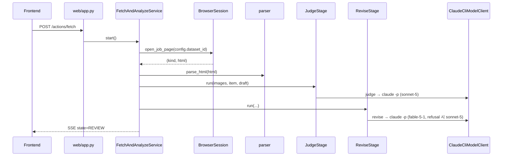
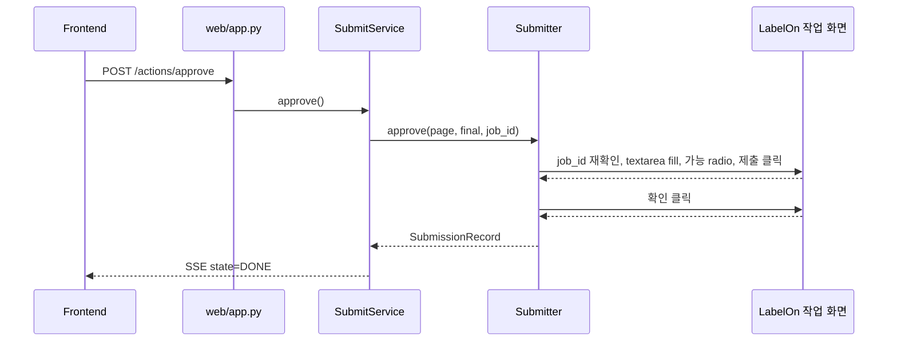

# Interaction Diagrams (Reverse Engineering, 2026-09-28)

## 건 가져오기·분석

## 승인 제출

## 변경 요청이 닿는 상호작용
- 가져오기 시퀀스의 `open_job_page(config.dataset_id)` 가 "사용자가 선택한 데이터셋"으로 바뀌어야 한다
- 프로젝트 홈에서 진행중 데이터셋 목록을 읽는 새 상호작용(BrowserSession 요청 API → parser)이 필요하다
